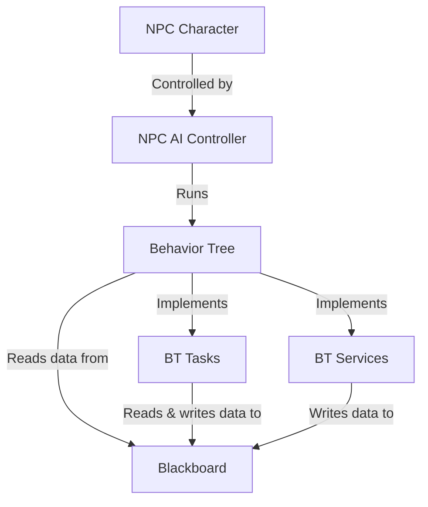

# GP25 AI Programming Assignment

## Overview
TODO:
- What the project goal is
- What the project contains (RED and GREEN NPCs)
- Tools used (engine, template, base classes & source control)

## Content Folder Structure
...

## NPC Implementation

TODO: discuss...
* Character BP
* Controller BP
* Blackboard
* Behavior Tree
* Behavior Tree Tasks
* Behavior Tree Services