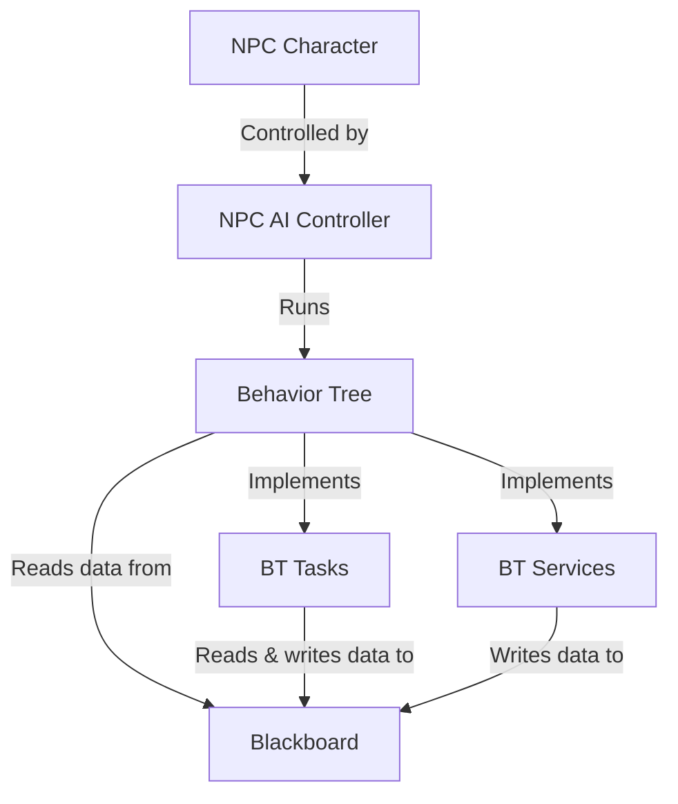

# GP25 AI Programming Assignment

## Overview
The goal of this project is to gain experience working with AI character tools and large-file source control in Unreal Engine. The heart of the project is a patrolling NPC implementation.

### Concept / Genre
The setting is ComicCon. The player character is awashed-up former celebrity who makes a living on the by signing autographs on the convention circuit for obsessed fans. The player character is on break, and must navigate the convention floor while avoiding detection by obsessed fans (who must register and wait in line to talk to them)

### Tools and Tech
*Environment*: Unreal Editor 5.7.4
*Project template*: Top-down third person
*Logic implementation*: Unreal blueprints
*Player movement*: Point-and-click / nav-mesh
*NPC control*: Behavior-tree / blackboard
*Source control*: Git with LFS support


## Content Folder Structure
```
Content/
|--Assignment/
|  |--NPC_00 (the RED guy)
|  |  |--BP_NPC_00_Character (character blueprint)
|  |  |--BP_NPC_00_Controller (AI controller blueprint)
|  |  |--BehaviorTree
|  |  |  |--BB_NPC_00_Blackboard
|  |  |  |--BT_NPC_00_BehaviorTree
|  |  |  |--(BT tasks & services blueprints)
|  |--NPC_01 (the GREEN guy)
|  |  |--BP_NPC_01_Character (character blueprint)
|  |  |--BP_NPC_01_Controller (AI controller blueprint)
|  |  |--BehaviorTree
|  |  |  |--BB_NPC_01_Blackboard
|  |  |  |--BT_NPC_01_BehaviorTree
|  |  |  |--(BT tasks & services blueprints)
|
(Template-provided folders & content)
|--Characters/
|  |--...
|--Cursor/
|  |--...
|--LevelPrototyping/
|  |--...
|--TopDown/
|  |--...

```

## NPC Implementation

### Outliner Hiererchy
```
Lvl_TopDown/ (Editor)
|--NPCS/
|  |--Team_00/ (RED guys)
|  |  |--NPC_00_00/
|  |  |  |--NPC_00_00_Character
|  |  |  |--PatrolPoints/ (serialized into character from the outliner)
|  |  |  |  |--TargetPoint_00
|  |  |  |  |--TargetPoint_01
|  |  |  |  |--(and so on)
|  |  |--NPC_00_01/
|  |  |  |-- (and so on)
|  |--Team_01/ (GREEN guys)
|  |  |--(and so on)
|
(Template-provided game objects)
|--Lighting/
|  |--...
|--Navigation/
|  |--...
|--Playground/
|  |--...
|--PlayerStart
|--RecastNavMesh-Default
|--WorldDataLayers
|--WorldPartitionMiniMap0
```

### NPC Component Architecture

## NPC Character
The NPC character is implemented as blueprint BP_NPC_00_Character. This is the actor that owns the NPC controller (below), and is placed in level ouliner. 
### Blueprint Variables
The BP exposes the following configuration variables to the outliner:
- PatrolPoints: An array of TargetPoint objects that indicate the locations of the NPCs looping patrol behavior.
- BaseWaitTime: A float that respresents the amount of time the NPC will rest at each patrol point before moving on to the next.
The NPC character also maintains an internal integer index indicating which patrol point is the current one.


### Blueprint Functions
The 


TODO: discuss...
* Character BP
* Controller BP
* Blackboard
* Behavior Tree
* Behavior Tree Tasks
* Behavior Tree Services