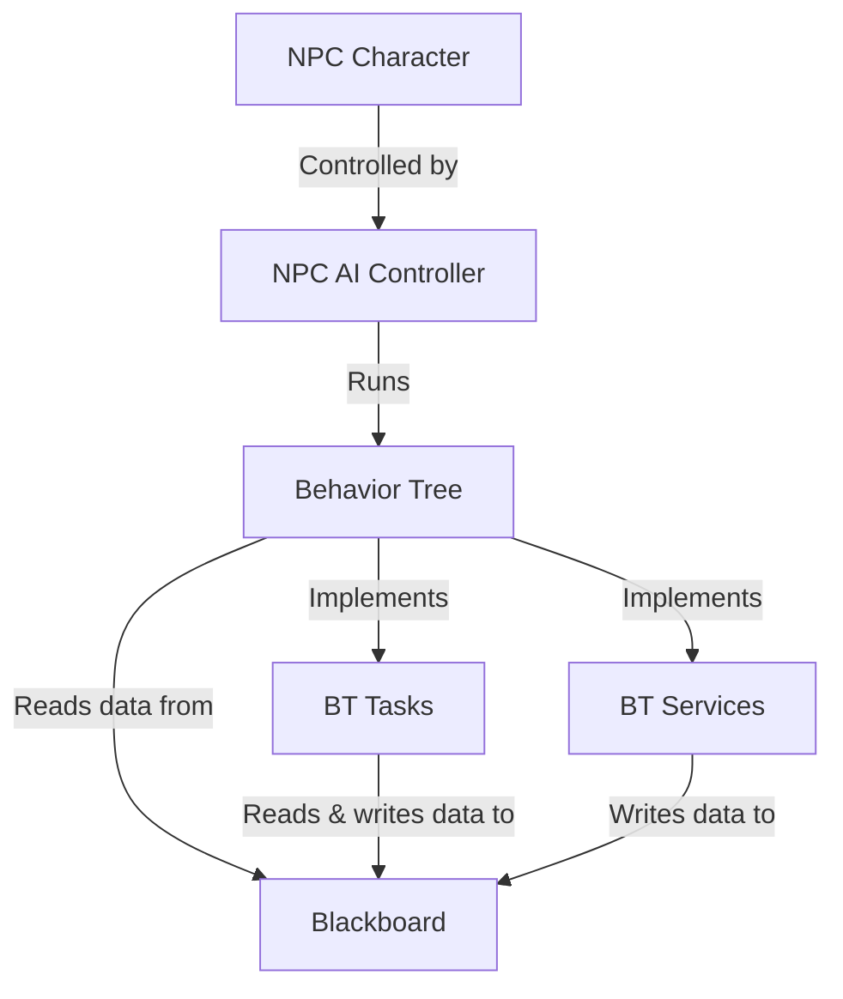

# GP25 AI Programming Assignment

## Overview
TODO:
- What the project goal is
- What the project contains (RED and GREEN NPCs)
- Tools used (engine, template, base classes & source control)

## Content Folder Structure
```
Content/
|--Assignment/
|  |--NPC_00 (the RED guy)
|  |  |--BP_NPC_00_Character (character blueprint)
|  |  |--BP_NPC_00_Controller (AI controller blueprint)
|  |  |--BehaviorTree
|  |  |  |--BB_NPC_00_Blackboard
|  |  |  |--BT_NPC_00_BehaviorTree
|  |  |  |--(BT tasks & services blueprints)
|  |--NPC_01 (the GREEN guy)
|  |  |--BP_NPC_01_Character (character blueprint)
|  |  |--BP_NPC_01_Controller (AI controller blueprint)
|  |  |--BehaviorTree
|  |  |  |--BB_NPC_01_Blackboard
|  |  |  |--BT_NPC_01_BehaviorTree
|  |  |  |--(BT tasks & services blueprints)
|
(Template-provided folders & content)
|--Characters...
|--Cursor...
|--LevelPrototyping...
|--TopDown...

```

## NPC Implementation


TODO: discuss...
* Character BP
* Controller BP
* Blackboard
* Behavior Tree
* Behavior Tree Tasks
* Behavior Tree Services