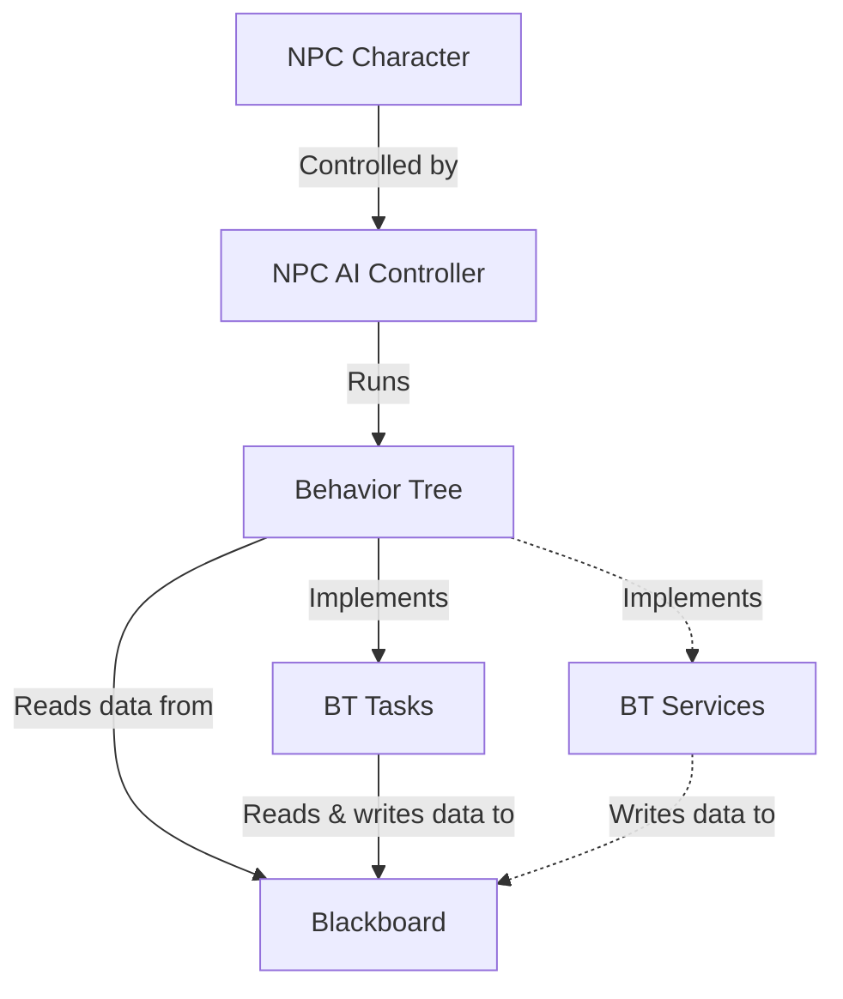

# GP25 AI Programming Assignment

## Overview
The goal of this project is to gain experience working with AI character tools and large-file source control in Unreal Engine. The heart of the project is a patrolling NPC implementation.

### Concept / Genre
The setting is ComicCon. The player character is a washed-up former celebrity who makes a living by signing autographs on the convention circuit for obsessed fans. The player character is on break, and must navigate the convention floor while avoiding detection by obsessed fans (who must register and wait in line to talk to them)

### Tools and Tech
*Environment*: Unreal Editor 5.7.4
*Project template*: Top-down third person
*Logic implementation*: Unreal blueprints
*Player movement*: Point-and-click / nav-mesh
*NPC control*: Behavior-tree / blackboard
*Source control*: Git with LFS support

### Video Link
[https://www.youtube.com/watch?v=JG_WnsNACF4](https://www.youtube.com/watch?v=JG_WnsNACF4)

[](https://www.youtube.com/watch?v=JG_WnsNACF4)


## Content Folder Structure
```
Content/
|--Assignment/
|  |--NPC_00 (the RED guy)
|  |  |--BP_NPC_00_Character (character blueprint)
|  |  |--BP_NPC_00_Controller (AI controller blueprint)
|  |  |--BehaviorTree
|  |  |  |--BB_NPC_00_Blackboard
|  |  |  |--BT_NPC_00_BehaviorTree
|  |  |  |--(BT tasks & services blueprints)
|  |--NPC_01 (the GREEN guy)
|  |  |--BP_NPC_01_Character (character blueprint)
|  |  |--BP_NPC_01_Controller (AI controller blueprint)
|  |  |--BehaviorTree
|  |  |  |--BB_NPC_01_Blackboard
|  |  |  |--BT_NPC_01_BehaviorTree
|  |  |  |--(BT tasks & services blueprints)
|
(Template-provided folders & content)
|--Characters/
|  |--...
|--Cursor/
|  |--...
|--LevelPrototyping/
|  |--...
|--TopDown/
|  |--...

```

## NPC Implementation

### Outliner Hiererchy
```
Lvl_TopDown/ (Editor)
|--NPCS/
|  |--Team_00/ (RED guys)
|  |  |--NPC_00_00/
|  |  |  |--NPC_00_00_Character
|  |  |  |--PatrolPoints/ (serialized into character from the outliner)
|  |  |  |  |--TargetPoint_00
|  |  |  |  |--TargetPoint_01
|  |  |  |  |--(and so on)
|  |  |--NPC_00_01/
|  |  |  |-- (and so on)
|  |--Team_01/ (GREEN guys)
|  |  |--(and so on)
|
(Template-provided game objects)
|--Lighting/
|  |--...
|--Navigation/
|  |--...
|--Playground/
|  |--...
|--PlayerStart
|--RecastNavMesh-Default
|--WorldDataLayers
|--WorldPartitionMiniMap0
```

### NPC Component Architecture


*Note: The current implementation does not use a behavior tree service. I originally had a service attached to the behavior tree's root selector that updates the `CanSeePlayer` blackboard value, but I moved this functionality into the NPC controller during refactoring.*

## NPC Character
The NPC character is implemented as blueprint BP_NPC_00_Character. This is the actor that owns the NPC controller (below), and is placed in level ouliner. This class inherits from the built-in `Character` blueprint, and uses the built-in "Quinn" character mesh.
### Blueprint Variables
The BP exposes the following configuration variables to the outliner:
- `PatrolPoints`: An array of `TargetPoint` objects that indicate the locations of the NPCs looping patrol behavior.
- `BaseWaitTime`: A float that indicates the amount of time the NPC idles at each patrol point before moving on to the next.

The NPC character also maintains an internal integer index indicating which patrol point is the current one, `currentPatrolPointIndex`

 

### Blueprint Functions
The NPC character BP implements two functions:
- `GetCurrentPatrolPointLoc`: Returns the vector3 transform location of the NPC's current `TargetPoint`, as indicated internally by `currentPatrolPointIndex`


- `IncrementCurrentPatrolPoint`: Increments the value of `currentPatrolPointIndex`, modulated by the size of the `PatrolPoints` array.


Both of these functions are used by BT_NPC_BehaviorTree implementation, discussed below.

## NPC Controller
### EventGraph


The NPC controller event graph defines behavior for two events...
- *Event Begin Play*: When the game starts, the EG associates itself with the behavior tree `BT_NPC_00_BehaviorTree` (discussed below), and initiates its activity.
- *Event Target Perception Updated*: Most of the controller's logic flows from this event. When the controller's `AIPerception` component (discussed below) signals that the player actor has entered or exited its perception field, it triggers the following logic:

    - *If the perception target is sensed* the EG updates the following blackboard keys in order:
        1) `LastKnownPlayerLocation`
        2) `CanSeePlayer`
        3) `IsChasingPlayer`

        The meaning of these keys is discussed below in the blackboard section.

    - *If the perception target is un-sensed* the EG sets the `CanSeePlayer` key to false. Importantly, the EG *does not* unset the `IsChasingPlayer` key here. This is because the NPC is expected to continue pursuing the player to its last known location and pause before returning to the patrol behavior.

### Blueprint Variables
The NPC controller has four internal variables of type `Name`, which hold the names of the blackboard keys that the controller must manipulate:
| `Name` variable name         | Value |
|------------------------------|-------|
| `CanSeePlayerKey`            | "CanSeePlayer" |
| `LastKnownPlayerLocationKey` | "LastKnownPlayerLocation" |
| `IsChasingPlayerKey`         | "IsChasingPlayer" |

### AI Perception
The NPC controller `AIPerception` component is configured with one sense (`AISense_Sight`)


## The NPC Blackboard

The NPC blackboard, `BB_NPC_00_Blackboard`, has six keys that inform the NPC behavior tree and in turn govern the NPC behavior:
- `SelfActor`: Built in self reference
- `MoveTarget`: Holds the transform location of the current patrol point
- `WaitSeconds`: The amount of time the NPC idles at each patrol point before moving on
- `CanSeePlayer`: Whether or not the player actor is currently sensed by AI perception
- `LastKnownPlayerLocation`: Where the player is, or was the last time we saw them
- `IsChasingPlayer`: Is true when the NPC is in chase mode, whether the player is seen or not


## The NPC Behavior Tree

The NPC behavior tree, `BT_NPC_00_BehaviorTree`, implements two distinct behaviors:

- Patrolling behavior: The NPC is moving between an array of `TargetPoint` transform locations in sequence
- Chase behavior: The NPC is actively pursuing the player actor. This branch has two distict sub-branches:
  - While the player is sensed by AI perception (sight), then the chase target is continuously updated with the player's transform location plus the player's directional velocity. If the player is standing still, then the chase target is simply the player's transform location. If the player is moving, then the chase target is a position slightly in front of the player in the direction of movement.
  - If the player becomes unsensed, then the chase target is no longer updated and the chase target is the last known player position. When the NPC reaches that position, it waits a configurable number of seconds. If the player remains unsensed during that interval, then the `IsChasingPlayer` boolean is flipped and the NPC reverts to its patrolling behavior.


### Patrolling Behavior:

In undecorated sequence:

1) Set the move target with task `BTT_NPC_00_SetMoveTarget`


2) In simple parallel, move to the current `MoveTarget` location and play the jog animation.

3) When the current `MoveTarget` is reached, call the NPC character's `IncrementPatrolPoint` function. This will cause the character to return the transform location of the next `TargetPoint` in its `PatrolPoints` array the next time `GetCurrentPatrolPointLoc` is called.


4) In simple parallel, wait for the amount of time indicated in the `WaitSeconds` blackboard key and play the idle animation.

### Chase Behavior

*If the player is sensed by AI perception, per the decorator for this branch*, then in sequence:

1) Set `LastKnownPlayerLocation` according to the the player's current transform location and velocity.


2) In simple parallel, move to the current `LastKnownPlayerLocation` and play the jog animation.

*If the player is not sensed by AI perception, but the NPC has not yet reached the `LastKnownPlayerLocation` per the decorator for this branch*, then in sequence:

1) In simple parallel, move to the `LastKnownPlayerLocation` (note that if the player is unsensed, then this value will not be updated every frame) and play the jog animation

2) In simple parallel, wait for a duration indicated by the `WaitSeconds` blackboard key and play the idle animation.

3) If `LastKnownPlayerLocation` is reached and the branch has not been preempted by the perception component, then unset the `IsChasingPlayer` blackboard key. This will cause the BT to revert to the patrol branch.


## Git Final Check

### Final Git status
```
PS C:\SchoolRepos\UNREAL\GP25_AI_PROGRAMMING_BRAD> git status
On branch main
Your branch is up to date with 'origin/main'.

nothing to commit, working tree clean
```

### LFS Tracking Binaries
```
PS C:\SchoolRepos\UNREAL\GP25_AI_PROGRAMMING_BRAD> git lfs ls-files
d47224ccdf * AI_ASSIGNMENT/Content/Assignment/NPC_00/BP_NPC_00_Character.uasset
53b03a4dcb * AI_ASSIGNMENT/Content/Assignment/NPC_00/BP_NPC_00_Controller.uasset
a4fda55760 * AI_ASSIGNMENT/Content/Assignment/NPC_00/BehaviorTree/BB_NPC_00_Blackboard.uasset
2da9e21f7c * AI_ASSIGNMENT/Content/Assignment/NPC_00/BehaviorTree/BTT_NPC_00_SetChaseTarget.uasset
5e6493005c * AI_ASSIGNMENT/Content/Assignment/NPC_00/BehaviorTree/BTT_NPC_00_SetMoveTarget.uasset
f5b260d473 * AI_ASSIGNMENT/Content/Assignment/NPC_00/BehaviorTree/BTT_NPC_00_StopChasing.uasset
875cc269d3 * AI_ASSIGNMENT/Content/Assignment/NPC_00/BehaviorTree/BTT_NPC_00_UpdatePatrolPoint.uasset
b44fa636e4 * AI_ASSIGNMENT/Content/Assignment/NPC_00/BehaviorTree/BT_NPC_00_BehaviorTree.uasset
0edd6a2354 * AI_ASSIGNMENT/Content/Assignment/NPC_01/BP_NPC_01_Character.uasset
ed28323f89 * AI_ASSIGNMENT/Content/Assignment/NPC_01/BP_NPC_01_Controller.uasset
061a1da6f0 * AI_ASSIGNMENT/Content/Assignment/NPC_01/BehaviorTree/BB_NPC_01_Blackboard.uasset
3e1bc0592a * AI_ASSIGNMENT/Content/Assignment/NPC_01/BehaviorTree/BT_NPC_01_BehaviorTree.uasset
fdee63c4a4 * AI_ASSIGNMENT/Content/Characters/Mannequins/Anims/Death/MM_Death_Back_01.uasset
c9daa694dd * AI_ASSIGNMENT/Content/Characters/Mannequins/Anims/Death/MM_Death_Front_01.uasset
dda4f9d6a4 * AI_ASSIGNMENT/Content/Characters/Mannequins/Anims/Death/MM_Death_Front_02.uasset
bf3a411d46 * AI_ASSIGNMENT/Content/Characters/Mannequins/Anims/Death/MM_Death_Front_03.uasset
712a25024f * AI_ASSIGNMENT/Content/Characters/Mannequins/Anims/Death/MM_Death_Left_01.uasset
7968e7e1bc * AI_ASSIGNMENT/Content/Characters/Mannequins/Anims/Death/MM_Death_Right_01.uasset
a4f2fca245 * AI_ASSIGNMENT/Content/Characters/Mannequins/Anims/Pistol/Aim/AO_Pistol.uasset
4d7113f179 * AI_ASSIGNMENT/Content/Characters/Mannequins/Anims/Pistol/Aim/MF_Pistol_Idle_ADS1.uasset
2898b38d8e * AI_ASSIGNMENT/Content/Characters/Mannequins/Anims/Pistol/Aim/MF_Pistol_Idle_ADS_AO_CD.uasset
e5c5855b58 * AI_ASSIGNMENT/Content/Characters/Mannequins/Anims/Pistol/Aim/MF_Pistol_Idle_ADS_AO_CU.uasset
f93aacabf4 * AI_ASSIGNMENT/Content/Characters/Mannequins/Anims/Pistol/Jog/MF_Pistol_Jog_Bwd.uasset
dc8a45c625 * AI_ASSIGNMENT/Content/Characters/Mannequins/Anims/Pistol/Jog/MF_Pistol_Jog_Bwd_Left.uasset
e6f80eb946 * AI_ASSIGNMENT/Content/Characters/Mannequins/Anims/Pistol/Jog/MF_Pistol_Jog_Bwd_Right.uasset
caba32a258 * AI_ASSIGNMENT/Content/Characters/Mannequins/Anims/Pistol/Jog/MF_Pistol_Jog_Fwd.uasset
8ed2295bbf * AI_ASSIGNMENT/Content/Characters/Mannequins/Anims/Pistol/Jog/MF_Pistol_Jog_Fwd_Left.uasset
d80c0c9bb0 * AI_ASSIGNMENT/Content/Characters/Mannequins/Anims/Pistol/Jog/MF_Pistol_Jog_Fwd_Right.uasset
4d8fcf3a8b * AI_ASSIGNMENT/Content/Characters/Mannequins/Anims/Pistol/Jog/MF_Pistol_Jog_Left.uasset
017f902b0a * AI_ASSIGNMENT/Content/Characters/Mannequins/Anims/Pistol/Jog/MF_Pistol_Jog_Right.uasset
7b01836fa3 * AI_ASSIGNMENT/Content/Characters/Mannequins/Anims/Pistol/Jump/MM_Pistol_Jump_Fall_Loop.uasset
e9935321b5 * AI_ASSIGNMENT/Content/Characters/Mannequins/Anims/Pistol/Jump/MM_Pistol_Jump_RecoveryAdditive.uasset
58c1e69b26 * AI_ASSIGNMENT/Content/Characters/Mannequins/Anims/Pistol/Jump/MM_Pistol_Jump_Start.uasset
766a02544f * AI_ASSIGNMENT/Content/Characters/Mannequins/Anims/Pistol/MF_Pistol_Idle_ADS.uasset
64b3c6dc73 * AI_ASSIGNMENT/Content/Characters/Mannequins/Anims/Pistol/MM_Pistol_DryFire.uasset
7f5a1ed2c1 * AI_ASSIGNMENT/Content/Characters/Mannequins/Anims/Pistol/MM_Pistol_Equip.uasset
ebd8467dbb * AI_ASSIGNMENT/Content/Characters/Mannequins/Anims/Pistol/MM_Pistol_Fire.uasset
2eabacc191 * AI_ASSIGNMENT/Content/Characters/Mannequins/Anims/Pistol/MM_Pistol_Fire_Montage.uasset
a821a77430 * AI_ASSIGNMENT/Content/Characters/Mannequins/Anims/Pistol/MM_Pistol_Reload.uasset
704dd7e116 * AI_ASSIGNMENT/Content/Characters/Mannequins/Anims/Pistol/Walk/MF_Pistol_Walk_Bwd.uasset
fff084ed3c * AI_ASSIGNMENT/Content/Characters/Mannequins/Anims/Pistol/Walk/MF_Pistol_Walk_Bwd_Left.uasset
26a82255db * AI_ASSIGNMENT/Content/Characters/Mannequins/Anims/Pistol/Walk/MF_Pistol_Walk_Bwd_Right.uasset
7ac6171e3b * AI_ASSIGNMENT/Content/Characters/Mannequins/Anims/Pistol/Walk/MF_Pistol_Walk_Fwd.uasset
bdd682c2a4 * AI_ASSIGNMENT/Content/Characters/Mannequins/Anims/Pistol/Walk/MF_Pistol_Walk_Fwd_Left.uasset
b9b42e230d * AI_ASSIGNMENT/Content/Characters/Mannequins/Anims/Pistol/Walk/MF_Pistol_Walk_Fwd_Right.uasset
bc5f5b9f35 * AI_ASSIGNMENT/Content/Characters/Mannequins/Anims/Pistol/Walk/MF_Pistol_Walk_Left.uasset
e72f68c9a3 * AI_ASSIGNMENT/Content/Characters/Mannequins/Anims/Pistol/Walk/MF_Pistol_Walk_Right.uasset
a3cfb9e380 * AI_ASSIGNMENT/Content/Characters/Mannequins/Anims/Rifle/AIM/AO_Rifle.uasset
9521c19419 * AI_ASSIGNMENT/Content/Characters/Mannequins/Anims/Rifle/AIM/MM_Rifle_Idle_ADS_AO_CC.uasset
09b2c98aa7 * AI_ASSIGNMENT/Content/Characters/Mannequins/Anims/Rifle/AIM/MM_Rifle_Idle_ADS_AO_CD.uasset
60969c39ff * AI_ASSIGNMENT/Content/Characters/Mannequins/Anims/Rifle/AIM/MM_Rifle_Idle_ADS_AO_CU.uasset
ecb41ae933 * AI_ASSIGNMENT/Content/Characters/Mannequins/Anims/Rifle/HitReact/MM_HitReact_Back_Med_01.uasset
e5caf5938c * AI_ASSIGNMENT/Content/Characters/Mannequins/Anims/Rifle/HitReact/MM_HitReact_Front_Hvy_01.uasset
ae8728f698 * AI_ASSIGNMENT/Content/Characters/Mannequins/Anims/Rifle/HitReact/MM_HitReact_Front_Lgt_01.uasset
dcb6c068d8 * AI_ASSIGNMENT/Content/Characters/Mannequins/Anims/Rifle/HitReact/MM_HitReact_Front_Lgt_02.uasset
3949df1228 * AI_ASSIGNMENT/Content/Characters/Mannequins/Anims/Rifle/HitReact/MM_HitReact_Front_Lgt_03.uasset
e0ed26de9c * AI_ASSIGNMENT/Content/Characters/Mannequins/Anims/Rifle/HitReact/MM_HitReact_Front_Lgt_04.uasset
cca3c893d6 * AI_ASSIGNMENT/Content/Characters/Mannequins/Anims/Rifle/HitReact/MM_HitReact_Front_Med_01.uasset
3acb6956f9 * AI_ASSIGNMENT/Content/Characters/Mannequins/Anims/Rifle/HitReact/MM_HitReact_Front_Med_02.uasset
0fd489f5c8 * AI_ASSIGNMENT/Content/Characters/Mannequins/Anims/Rifle/Jog/MF_Rifle_Jog_Bwd.uasset
c3939c4aa2 * AI_ASSIGNMENT/Content/Characters/Mannequins/Anims/Rifle/Jog/MF_Rifle_Jog_Bwd_Left.uasset
907cb106c1 * AI_ASSIGNMENT/Content/Characters/Mannequins/Anims/Rifle/Jog/MF_Rifle_Jog_Bwd_Right.uasset
287d39883a * AI_ASSIGNMENT/Content/Characters/Mannequins/Anims/Rifle/Jog/MF_Rifle_Jog_Fwd.uasset
4103ea6388 * AI_ASSIGNMENT/Content/Characters/Mannequins/Anims/Rifle/Jog/MF_Rifle_Jog_Fwd_Left.uasset
2ca8d8ec88 * AI_ASSIGNMENT/Content/Characters/Mannequins/Anims/Rifle/Jog/MF_Rifle_Jog_Fwd_Right.uasset
4feaf1bd5b * AI_ASSIGNMENT/Content/Characters/Mannequins/Anims/Rifle/Jog/MF_Rifle_Jog_Left.uasset
e3c5cae544 * AI_ASSIGNMENT/Content/Characters/Mannequins/Anims/Rifle/Jog/MF_Rifle_Jog_Right.uasset
39acbd6bcf * AI_ASSIGNMENT/Content/Characters/Mannequins/Anims/Rifle/Jump/MM_Rifle_Jump_Apex.uasset
ce74e83b9b * AI_ASSIGNMENT/Content/Characters/Mannequins/Anims/Rifle/Jump/MM_Rifle_Jump_Fall_Land.uasset
d17c0a4fe1 * AI_ASSIGNMENT/Content/Characters/Mannequins/Anims/Rifle/Jump/MM_Rifle_Jump_Fall_Loop.uasset
9d663743ac * AI_ASSIGNMENT/Content/Characters/Mannequins/Anims/Rifle/Jump/MM_Rifle_Jump_RecoveryAdditive.uasset
925f27182b * AI_ASSIGNMENT/Content/Characters/Mannequins/Anims/Rifle/Jump/MM_Rifle_Jump_Start.uasset
c2da3d291d * AI_ASSIGNMENT/Content/Characters/Mannequins/Anims/Rifle/Jump/MM_Rifle_Jump_Start_Loop.uasset
cfa32b1920 * AI_ASSIGNMENT/Content/Characters/Mannequins/Anims/Rifle/MF_Rifle_Idle_ADS.uasset
131e01f0a3 * AI_ASSIGNMENT/Content/Characters/Mannequins/Anims/Rifle/MM_Rifle_DryFire.uasset
136b19498b * AI_ASSIGNMENT/Content/Characters/Mannequins/Anims/Rifle/MM_Rifle_Equip.uasset
1c5b983bd6 * AI_ASSIGNMENT/Content/Characters/Mannequins/Anims/Rifle/MM_Rifle_Fire.uasset
ac1e17d2ac * AI_ASSIGNMENT/Content/Characters/Mannequins/Anims/Rifle/MM_Rifle_Reload.uasset
e1400dc7a7 * AI_ASSIGNMENT/Content/Characters/Mannequins/Anims/Rifle/Walk/MF_Rifle_Walk_Bwd.uasset
8d535eb181 * AI_ASSIGNMENT/Content/Characters/Mannequins/Anims/Rifle/Walk/MF_Rifle_Walk_Bwd_Left.uasset
6e0bd9b3ba * AI_ASSIGNMENT/Content/Characters/Mannequins/Anims/Rifle/Walk/MF_Rifle_Walk_Bwd_Right.uasset
540a6a77c4 * AI_ASSIGNMENT/Content/Characters/Mannequins/Anims/Rifle/Walk/MF_Rifle_Walk_Fwd.uasset
f7797a7841 * AI_ASSIGNMENT/Content/Characters/Mannequins/Anims/Rifle/Walk/MF_Rifle_Walk_Fwd_Left.uasset
787c7b69a0 * AI_ASSIGNMENT/Content/Characters/Mannequins/Anims/Rifle/Walk/MF_Rifle_Walk_Fwd_Right.uasset
a99d18722e * AI_ASSIGNMENT/Content/Characters/Mannequins/Anims/Rifle/Walk/MF_Rifle_Walk_Left.uasset
2c2c12d6a9 * AI_ASSIGNMENT/Content/Characters/Mannequins/Anims/Rifle/Walk/MF_Rifle_Walk_Right.uasset
60ae8c9701 * AI_ASSIGNMENT/Content/Characters/Mannequins/Anims/Unarmed/ABP_Unarmed.uasset
f796113f17 * AI_ASSIGNMENT/Content/Characters/Mannequins/Anims/Unarmed/Attack/MM_Attack_01.uasset
fb3c74b8e3 * AI_ASSIGNMENT/Content/Characters/Mannequins/Anims/Unarmed/Attack/MM_Attack_02.uasset
1c66016fc3 * AI_ASSIGNMENT/Content/Characters/Mannequins/Anims/Unarmed/Attack/MM_Attack_03.uasset
5d9b0fc689 * AI_ASSIGNMENT/Content/Characters/Mannequins/Anims/Unarmed/Attack/MM_ChargedAttack.uasset
bc71af8768 * AI_ASSIGNMENT/Content/Characters/Mannequins/Anims/Unarmed/BS_Idle_Walk_Run.uasset
1f6e9448f0 * AI_ASSIGNMENT/Content/Characters/Mannequins/Anims/Unarmed/Jog/MF_Unarmed_Jog_Bwd.uasset
e6e68e6cf4 * AI_ASSIGNMENT/Content/Characters/Mannequins/Anims/Unarmed/Jog/MF_Unarmed_Jog_Bwd_Left.uasset
ee3137ff2b * AI_ASSIGNMENT/Content/Characters/Mannequins/Anims/Unarmed/Jog/MF_Unarmed_Jog_Bwd_Right.uasset
0ccbe851f8 * AI_ASSIGNMENT/Content/Characters/Mannequins/Anims/Unarmed/Jog/MF_Unarmed_Jog_Fwd.uasset
12ee5a11f2 * AI_ASSIGNMENT/Content/Characters/Mannequins/Anims/Unarmed/Jog/MF_Unarmed_Jog_Fwd_Left.uasset
66a7561d60 * AI_ASSIGNMENT/Content/Characters/Mannequins/Anims/Unarmed/Jog/MF_Unarmed_Jog_Fwd_Right.uasset
f7842445f0 * AI_ASSIGNMENT/Content/Characters/Mannequins/Anims/Unarmed/Jog/MF_Unarmed_Jog_Left.uasset
208f642310 * AI_ASSIGNMENT/Content/Characters/Mannequins/Anims/Unarmed/Jog/MF_Unarmed_Jog_Right.uasset
8a1c964403 * AI_ASSIGNMENT/Content/Characters/Mannequins/Anims/Unarmed/Jump/MM_Dash.uasset
408be742c6 * AI_ASSIGNMENT/Content/Characters/Mannequins/Anims/Unarmed/Jump/MM_Fall_Loop.uasset
252cbf69b0 * AI_ASSIGNMENT/Content/Characters/Mannequins/Anims/Unarmed/Jump/MM_Jump.uasset
a00de25a6b * AI_ASSIGNMENT/Content/Characters/Mannequins/Anims/Unarmed/Jump/MM_Land.uasset
e29af6dc13 * AI_ASSIGNMENT/Content/Characters/Mannequins/Anims/Unarmed/Jump/MM_WallJump.uasset
11ee7fdeb8 * AI_ASSIGNMENT/Content/Characters/Mannequins/Anims/Unarmed/MM_Idle.uasset
ae0c2ee1c1 * AI_ASSIGNMENT/Content/Characters/Mannequins/Anims/Unarmed/Walk/MF_Unarmed_Walk_Bwd.uasset
7c25a8eebb * AI_ASSIGNMENT/Content/Characters/Mannequins/Anims/Unarmed/Walk/MF_Unarmed_Walk_Bwd_Left.uasset
8c71b9bbf7 * AI_ASSIGNMENT/Content/Characters/Mannequins/Anims/Unarmed/Walk/MF_Unarmed_Walk_Bwd_Right.uasset
c74b2fc0cb * AI_ASSIGNMENT/Content/Characters/Mannequins/Anims/Unarmed/Walk/MF_Unarmed_Walk_Fwd.uasset
a7d8ff5a55 * AI_ASSIGNMENT/Content/Characters/Mannequins/Anims/Unarmed/Walk/MF_Unarmed_Walk_Fwd_Left.uasset
67d3d4fed0 * AI_ASSIGNMENT/Content/Characters/Mannequins/Anims/Unarmed/Walk/MF_Unarmed_Walk_Fwd_Right.uasset
81500e4fcd * AI_ASSIGNMENT/Content/Characters/Mannequins/Anims/Unarmed/Walk/MF_Unarmed_Walk_Left.uasset
f5922b4e63 * AI_ASSIGNMENT/Content/Characters/Mannequins/Anims/Unarmed/Walk/MF_Unarmed_Walk_Right.uasset
d7ffe412d9 * AI_ASSIGNMENT/Content/Characters/Mannequins/Materials/M_Mannequin.uasset
9f1e4ed382 * AI_ASSIGNMENT/Content/Characters/Mannequins/Materials/Manny/MI_Manny_01_New.uasset
26389db06f * AI_ASSIGNMENT/Content/Characters/Mannequins/Materials/Manny/MI_Manny_02_New.uasset
62a3050ef2 * AI_ASSIGNMENT/Content/Characters/Mannequins/Materials/Quinn/MI_Quinn_01.uasset
14d34e4234 * AI_ASSIGNMENT/Content/Characters/Mannequins/Materials/Quinn/MI_Quinn_01_GREEN.uasset
f82f9ca8af * AI_ASSIGNMENT/Content/Characters/Mannequins/Materials/Quinn/MI_Quinn_01_RED.uasset
6aec77489f * AI_ASSIGNMENT/Content/Characters/Mannequins/Materials/Quinn/MI_Quinn_02.uasset
a56334374d * AI_ASSIGNMENT/Content/Characters/Mannequins/Materials/Quinn/MI_Quinn_02_GREEN.uasset
514f2a4474 * AI_ASSIGNMENT/Content/Characters/Mannequins/Materials/Quinn/MI_Quinn_02_RED.uasset
be9f011191 * AI_ASSIGNMENT/Content/Characters/Mannequins/Meshes/SKM_Manny_Simple.uasset
770e615188 * AI_ASSIGNMENT/Content/Characters/Mannequins/Meshes/SKM_Quinn_GREEN.uasset
66676a8a00 * AI_ASSIGNMENT/Content/Characters/Mannequins/Meshes/SKM_Quinn_RED.uasset
1ef45d9250 * AI_ASSIGNMENT/Content/Characters/Mannequins/Meshes/SKM_Quinn_Simple.uasset
22029d4745 * AI_ASSIGNMENT/Content/Characters/Mannequins/Meshes/SK_Mannequin.uasset
57f84458a1 * AI_ASSIGNMENT/Content/Characters/Mannequins/Rigs/CR_Mannequin_Body.uasset
aa01be065d * AI_ASSIGNMENT/Content/Characters/Mannequins/Rigs/CR_Mannequin_FootIK.uasset
057818dd3e * AI_ASSIGNMENT/Content/Characters/Mannequins/Rigs/CR_Mannequin_Procedural.uasset
c0ceaf0039 * AI_ASSIGNMENT/Content/Characters/Mannequins/Rigs/PA_Mannequin.uasset
2f62320957 * AI_ASSIGNMENT/Content/Characters/Mannequins/Textures/Manny/T_Manny_01_BN.uasset
6ae0f4f990 * AI_ASSIGNMENT/Content/Characters/Mannequins/Textures/Manny/T_Manny_01_D.uasset
3e42e888ae * AI_ASSIGNMENT/Content/Characters/Mannequins/Textures/Manny/T_Manny_01_MRA.uasset
c9575d21c9 * AI_ASSIGNMENT/Content/Characters/Mannequins/Textures/Manny/T_Manny_02_BN.uasset
4747287132 * AI_ASSIGNMENT/Content/Characters/Mannequins/Textures/Manny/T_Manny_02_D.uasset
6697972eaf * AI_ASSIGNMENT/Content/Characters/Mannequins/Textures/Manny/T_Manny_02_MRA.uasset
61a9db73f7 * AI_ASSIGNMENT/Content/Characters/Mannequins/Textures/Manny/T_Manny_02_N.uasset
04e5ed207b * AI_ASSIGNMENT/Content/Characters/Mannequins/Textures/Quinn/T_Quinn_01_D.uasset
0988d4d9f2 * AI_ASSIGNMENT/Content/Characters/Mannequins/Textures/Quinn/T_Quinn_01_MRA.uasset
10fbe9ac3e * AI_ASSIGNMENT/Content/Characters/Mannequins/Textures/Quinn/T_Quinn_01_N.uasset
f0ccb2f465 * AI_ASSIGNMENT/Content/Characters/Mannequins/Textures/Quinn/T_Quinn_02_D.uasset
9f7e495cbe * AI_ASSIGNMENT/Content/Characters/Mannequins/Textures/Quinn/T_Quinn_02_MRA.uasset
0bc26466e9 * AI_ASSIGNMENT/Content/Characters/Mannequins/Textures/Quinn/T_Quinn_02_N.uasset
34e6fa3414 * AI_ASSIGNMENT/Content/Characters/Mannequins/Textures/Shared/T_UE_Logo_M.uasset
ebf03ad281 * AI_ASSIGNMENT/Content/Cursor/FX_Cursor.uasset
fbd1a950d9 * AI_ASSIGNMENT/Content/Cursor/M_Cursor.uasset
19cf635c9c * AI_ASSIGNMENT/Content/Cursor/SM_CursorMesh.uasset
cbf467ede1 * AI_ASSIGNMENT/Content/Cursor/T_Arrow.uasset
4386d7d71b * AI_ASSIGNMENT/Content/LevelPrototyping/Interactable/Door/BP_DoorFrame.uasset
fa98c4fc50 * AI_ASSIGNMENT/Content/LevelPrototyping/Interactable/Door/Meshes/SM_Door.uasset
383dea9555 * AI_ASSIGNMENT/Content/LevelPrototyping/Interactable/Door/Meshes/SM_DoorFrame_Corner.uasset
26eb76a2ce * AI_ASSIGNMENT/Content/LevelPrototyping/Interactable/Door/Meshes/SM_DoorFrame_Edge.uasset
6fd40bc38b * AI_ASSIGNMENT/Content/LevelPrototyping/Interactable/JumpPad/Assets/Materials/MI_GlowNT.uasset
c1b29ad29c * AI_ASSIGNMENT/Content/LevelPrototyping/Interactable/JumpPad/Assets/Materials/M_GradientGlow.uasset
e609824254 * AI_ASSIGNMENT/Content/LevelPrototyping/Interactable/JumpPad/Assets/Materials/M_SimpleGlow.uasset
97fbe3da2d * AI_ASSIGNMENT/Content/LevelPrototyping/Interactable/JumpPad/Assets/Meshes/SM_CircularBand.uasset
6ddb27bf70 * AI_ASSIGNMENT/Content/LevelPrototyping/Interactable/JumpPad/Assets/Meshes/SM_CircularGlow.uasset
2e76849cbb * AI_ASSIGNMENT/Content/LevelPrototyping/Interactable/JumpPad/Assets/NS_JumpPad.uasset
42ba8262f0 * AI_ASSIGNMENT/Content/LevelPrototyping/Interactable/JumpPad/BP_JumpPad.uasset
378ace355b * AI_ASSIGNMENT/Content/LevelPrototyping/Interactable/Target/Assets/SM_TargetBaseMesh.uasset
8bd8784bf0 * AI_ASSIGNMENT/Content/LevelPrototyping/Interactable/Target/BP_WobbleTarget.uasset
e5ee13abdb * AI_ASSIGNMENT/Content/LevelPrototyping/Materials/MF_ProcGrid.uasset
786a4dfcaa * AI_ASSIGNMENT/Content/LevelPrototyping/Materials/MI_DefaultColorway.uasset
084681bf68 * AI_ASSIGNMENT/Content/LevelPrototyping/Materials/MI_PrototypeGrid_Gray.uasset
fa0f2a06a7 * AI_ASSIGNMENT/Content/LevelPrototyping/Materials/MI_PrototypeGrid_Gray_02.uasset
901ec868e8 * AI_ASSIGNMENT/Content/LevelPrototyping/Materials/MI_PrototypeGrid_Gray_Round.uasset
838034e5af * AI_ASSIGNMENT/Content/LevelPrototyping/Materials/MI_PrototypeGrid_TopDark.uasset
41dbbda4b4 * AI_ASSIGNMENT/Content/LevelPrototyping/Materials/M_FlatCol.uasset
bf8625ad59 * AI_ASSIGNMENT/Content/LevelPrototyping/Materials/M_PrototypeGrid.uasset
b20a3ae966 * AI_ASSIGNMENT/Content/LevelPrototyping/Meshes/SM_ChamferCube.uasset
4680317a8c * AI_ASSIGNMENT/Content/LevelPrototyping/Meshes/SM_Cube.uasset
76aaa3c2b8 * AI_ASSIGNMENT/Content/LevelPrototyping/Meshes/SM_Cylinder.uasset
39ab83dc57 * AI_ASSIGNMENT/Content/LevelPrototyping/Meshes/SM_Plane.uasset
4087b3f857 * AI_ASSIGNMENT/Content/LevelPrototyping/Meshes/SM_QuarterCylinder.uasset
ab58a5224d * AI_ASSIGNMENT/Content/LevelPrototyping/Meshes/SM_QuarterCylinderOuter.uasset
e5b472deb3 * AI_ASSIGNMENT/Content/LevelPrototyping/Meshes/SM_Ramp.uasset
bb83347670 * AI_ASSIGNMENT/Content/LevelPrototyping/Textures/T_GridChecker_A.uasset
dce2875cf6 * AI_ASSIGNMENT/Content/TopDown/Blueprints/BP_TopDownCharacter.uasset
255fe60f16 * AI_ASSIGNMENT/Content/TopDown/Blueprints/BP_TopDownController.uasset
80a42139b6 * AI_ASSIGNMENT/Content/TopDown/Blueprints/BP_TopDownGameMode.uasset
f7769fce32 * AI_ASSIGNMENT/Content/TopDown/Cursor/FX_Cursor_Failure.uasset
9e8e3c98c5 * AI_ASSIGNMENT/Content/TopDown/Cursor/FX_Cursor_Success.uasset
a31d5077cd * AI_ASSIGNMENT/Content/TopDown/Cursor/MI_Cursor_Red.uasset
2ffc20373e * AI_ASSIGNMENT/Content/TopDown/Cursor/M_Cursor.uasset
7068889af0 * AI_ASSIGNMENT/Content/TopDown/Cursor/SM_CursorMesh.uasset
31814e3ac0 * AI_ASSIGNMENT/Content/TopDown/Cursor/SM_CursorMesh_Red.uasset
d275db5501 * AI_ASSIGNMENT/Content/TopDown/Cursor/T_Arrow.uasset
cf95eaaa4c * AI_ASSIGNMENT/Content/TopDown/Input/Actions/IA_SetDestination_Click.uasset
dea4d46a31 * AI_ASSIGNMENT/Content/TopDown/Input/Actions/IA_SetDestination_Touch.uasset
395f6a548e * AI_ASSIGNMENT/Content/TopDown/Input/IMC_Default.uasset
007ced33b2 * AI_ASSIGNMENT/Content/TopDown/Lvl_TopDown.umap
31f0503715 * AI_ASSIGNMENT/Content/TopDown/MI_Colorway.uasset
02effb9c95 * AI_ASSIGNMENT/Content/__ExternalActors__/TopDown/Lvl_TopDown/0/NN/3CMPIWCJ6XQCTHX57Y8AOG.uasset
259927e8a4 * AI_ASSIGNMENT/Content/__ExternalActors__/TopDown/Lvl_TopDown/1/1Q/F46CVW0W1B7S6J4YDGEL8F.uasset
c6653080eb * AI_ASSIGNMENT/Content/__ExternalActors__/TopDown/Lvl_TopDown/1/ED/GP2N37NOM204TM8HSIOHDA.uasset
a2399eb181 * AI_ASSIGNMENT/Content/__ExternalActors__/TopDown/Lvl_TopDown/1/H7/HXHBY8XB24FN2PZ9N5HJNL.uasset
5cf221a3c2 * AI_ASSIGNMENT/Content/__ExternalActors__/TopDown/Lvl_TopDown/1/KK/FN2AKQMCUI8N4G72TP2P2F.uasset
1cef7dbd66 * AI_ASSIGNMENT/Content/__ExternalActors__/TopDown/Lvl_TopDown/1/RQ/JQBEDFO07FYQTBAZRBESFQ.uasset
f49c2427f7 * AI_ASSIGNMENT/Content/__ExternalActors__/TopDown/Lvl_TopDown/1/RT/UXR7VJZGTACYQ5KESB48LQ.uasset
45af0a5627 * AI_ASSIGNMENT/Content/__ExternalActors__/TopDown/Lvl_TopDown/1/SW/XDDW2UFRQWQEHQ45U62WCG.uasset
593f3464b9 * AI_ASSIGNMENT/Content/__ExternalActors__/TopDown/Lvl_TopDown/1/WI/54CLCT4Y9TRDQT3H5CBBO2.uasset
ad6a64324b * AI_ASSIGNMENT/Content/__ExternalActors__/TopDown/Lvl_TopDown/1/Y4/CP52WV1UMP464PD8ICZOTA.uasset
09e2d8564d * AI_ASSIGNMENT/Content/__ExternalActors__/TopDown/Lvl_TopDown/2/0B/PMMHST2XKRV46LOJVX1P5K.uasset
657200da6f * AI_ASSIGNMENT/Content/__ExternalActors__/TopDown/Lvl_TopDown/2/1W/YHRY4WLD8BTNQ6QGV0P0HD.uasset
0095ea8787 * AI_ASSIGNMENT/Content/__ExternalActors__/TopDown/Lvl_TopDown/2/33/SKUR0WWL7JT7C3OXZMWAQS.uasset
dbd891af52 * AI_ASSIGNMENT/Content/__ExternalActors__/TopDown/Lvl_TopDown/2/61/60FIR4WIA8GD48BO3JSN24.uasset
b54d8c4ec6 * AI_ASSIGNMENT/Content/__ExternalActors__/TopDown/Lvl_TopDown/2/EU/C5FXL3H56VG2BGRBVI945A.uasset
c72ad63d81 * AI_ASSIGNMENT/Content/__ExternalActors__/TopDown/Lvl_TopDown/3/3W/KVKK3JZ9YOQDKZN4SA819U.uasset
ab1fe92575 * AI_ASSIGNMENT/Content/__ExternalActors__/TopDown/Lvl_TopDown/3/CW/56AIQIG8EY856KXH0VLORI.uasset
1f9bb03796 * AI_ASSIGNMENT/Content/__ExternalActors__/TopDown/Lvl_TopDown/3/DB/3WAT7AKB2FD7W2F2FBB3RL.uasset
a9d7330945 * AI_ASSIGNMENT/Content/__ExternalActors__/TopDown/Lvl_TopDown/3/G8/1G76N8INZSWNC9JBWFGS5T.uasset
ec3db9a456 * AI_ASSIGNMENT/Content/__ExternalActors__/TopDown/Lvl_TopDown/4/3R/FBA0Z00NHOZRLY2VS6QWS5.uasset
d41617d4c3 * AI_ASSIGNMENT/Content/__ExternalActors__/TopDown/Lvl_TopDown/4/44/O3VCSBLL6THUF82WHBV30C.uasset
debd886944 * AI_ASSIGNMENT/Content/__ExternalActors__/TopDown/Lvl_TopDown/4/AH/Q0LWU54DITS9SGJR66EGIS.uasset
a6f55b7a6f * AI_ASSIGNMENT/Content/__ExternalActors__/TopDown/Lvl_TopDown/4/EF/HK90174B848TUVF24GPVDP.uasset
fed0dbadae * AI_ASSIGNMENT/Content/__ExternalActors__/TopDown/Lvl_TopDown/5/CX/A7OPC97BX8KJVUHQXB7W3B.uasset
dcf7ec7072 * AI_ASSIGNMENT/Content/__ExternalActors__/TopDown/Lvl_TopDown/5/FO/ECPD0L2VGZ9HAW86J7D07O.uasset
f88c497b83 * AI_ASSIGNMENT/Content/__ExternalActors__/TopDown/Lvl_TopDown/5/IC/3SZFZ2ZAEG8Q30V5SFUW4M.uasset
9354fe13d2 * AI_ASSIGNMENT/Content/__ExternalActors__/TopDown/Lvl_TopDown/5/K6/1QGN5VUZGWNPSCSIJ5TFZV.uasset
9d4d44d142 * AI_ASSIGNMENT/Content/__ExternalActors__/TopDown/Lvl_TopDown/5/MU/RF58KVN4H83EF3SOHF978Y.uasset
aff4b307d0 * AI_ASSIGNMENT/Content/__ExternalActors__/TopDown/Lvl_TopDown/5/TK/BEGV01JEMC3BQKMHDEA7SB.uasset
5a9cfc650a * AI_ASSIGNMENT/Content/__ExternalActors__/TopDown/Lvl_TopDown/5/YY/DCNP76EKY2NIEQOU3GCI21.uasset
8179d36da3 * AI_ASSIGNMENT/Content/__ExternalActors__/TopDown/Lvl_TopDown/6/38/VQ8HM2V1RTOU5IAUWY4WGW.uasset
dd10a6bd1f * AI_ASSIGNMENT/Content/__ExternalActors__/TopDown/Lvl_TopDown/6/BR/RKUYILN19HI6XFGOFGE6Z0.uasset
6bc429a973 * AI_ASSIGNMENT/Content/__ExternalActors__/TopDown/Lvl_TopDown/6/CE/DT9U6EGO7HSBDBDH26PHEU.uasset
10f24007af * AI_ASSIGNMENT/Content/__ExternalActors__/TopDown/Lvl_TopDown/6/MF/489IW7U7P9MIAKUIULAEPS.uasset
ff678de665 * AI_ASSIGNMENT/Content/__ExternalActors__/TopDown/Lvl_TopDown/6/SX/UJD585HI4TXMW9YG4YAQO1.uasset
82f3fd36a7 * AI_ASSIGNMENT/Content/__ExternalActors__/TopDown/Lvl_TopDown/6/TH/Z8NDYBYXW69596N30WYMU7.uasset
a9d930b04c * AI_ASSIGNMENT/Content/__ExternalActors__/TopDown/Lvl_TopDown/7/4B/T1PIVNI01BWDPTT6KC0IOK.uasset
e788c4b668 * AI_ASSIGNMENT/Content/__ExternalActors__/TopDown/Lvl_TopDown/7/6M/QTS3CWKKBCQU2OQX281KWZ.uasset
1b54381164 * AI_ASSIGNMENT/Content/__ExternalActors__/TopDown/Lvl_TopDown/7/BJ/L39MUIB1NBXJG64B8GGH7M.uasset
dbefde9e35 * AI_ASSIGNMENT/Content/__ExternalActors__/TopDown/Lvl_TopDown/7/KG/Z244DLZ4A8Z1G0U4TUR3VR.uasset
32fdea9002 * AI_ASSIGNMENT/Content/__ExternalActors__/TopDown/Lvl_TopDown/7/NA/4DMAZX2N566NQIXEI3N7ZM.uasset
f9a89266d9 * AI_ASSIGNMENT/Content/__ExternalActors__/TopDown/Lvl_TopDown/7/PF/I0DNH0U6BTFFYSKQYHTIC2.uasset
d459f48716 * AI_ASSIGNMENT/Content/__ExternalActors__/TopDown/Lvl_TopDown/8/PY/QMLKP6A3WDUNKON0OGPXW6.uasset
850fccdbcd * AI_ASSIGNMENT/Content/__ExternalActors__/TopDown/Lvl_TopDown/8/WB/6PI167HQFE7JE1UDZMWHFU.uasset
526f4437d6 * AI_ASSIGNMENT/Content/__ExternalActors__/TopDown/Lvl_TopDown/8/ZC/AEN0UZTTWKMZJ1XPPGBGO5.uasset
3c442eb13f * AI_ASSIGNMENT/Content/__ExternalActors__/TopDown/Lvl_TopDown/9/4A/ST5Z18WJPU160DNFMMDKF4.uasset
382ecbc26a * AI_ASSIGNMENT/Content/__ExternalActors__/TopDown/Lvl_TopDown/9/ET/CJYNHIA8Q1L3GDDFQYJN2Y.uasset
97ed8f0c7a * AI_ASSIGNMENT/Content/__ExternalActors__/TopDown/Lvl_TopDown/9/OW/75DR5F3ICVIHE723FRDK10.uasset
9edeeee16a * AI_ASSIGNMENT/Content/__ExternalActors__/TopDown/Lvl_TopDown/9/V9/VCZ6Z3BRAFZ7RBG1Y9IVQD.uasset
efec258d32 * AI_ASSIGNMENT/Content/__ExternalActors__/TopDown/Lvl_TopDown/9/WQ/51PDRV46P7JL5FIO4B5L5F.uasset
62fd2da002 * AI_ASSIGNMENT/Content/__ExternalActors__/TopDown/Lvl_TopDown/9/XA/AKS4QGDKLNT2ECMCM0OSYJ.uasset
55552a4604 * AI_ASSIGNMENT/Content/__ExternalActors__/TopDown/Lvl_TopDown/A/11/XDMMS42FJJ729ISOP9VU34.uasset
0187c9e5fd * AI_ASSIGNMENT/Content/__ExternalActors__/TopDown/Lvl_TopDown/A/3I/L42FC3SQPNLGCNAE52AMJA.uasset
f3c1fdcbba * AI_ASSIGNMENT/Content/__ExternalActors__/TopDown/Lvl_TopDown/A/5A/KTSYE0W4GAVEEND2N4QX63.uasset
45610ecf32 * AI_ASSIGNMENT/Content/__ExternalActors__/TopDown/Lvl_TopDown/A/70/4IY5U6C2M9CS24FTWXQG2A.uasset
447b2df33a * AI_ASSIGNMENT/Content/__ExternalActors__/TopDown/Lvl_TopDown/A/FM/E2Z2GWJUV6DYF4T64DU12Y.uasset
d67b7491a5 * AI_ASSIGNMENT/Content/__ExternalActors__/TopDown/Lvl_TopDown/A/OH/Y1ZP20LMYSF59GW0VJUKT3.uasset
ab19003ade * AI_ASSIGNMENT/Content/__ExternalActors__/TopDown/Lvl_TopDown/A/UI/FYPDNBRF80ZC1CFUDAJ8O0.uasset
082bc22578 * AI_ASSIGNMENT/Content/__ExternalActors__/TopDown/Lvl_TopDown/A/YL/1UGI5CDSHDTGY7AC1MZ76X.uasset
19cd27a148 * AI_ASSIGNMENT/Content/__ExternalActors__/TopDown/Lvl_TopDown/B/HK/5C7FMPWMFNNW4N5A6KM7CJ.uasset
9da2a3ba21 * AI_ASSIGNMENT/Content/__ExternalActors__/TopDown/Lvl_TopDown/B/OB/YMZYCHVGA5XZMFBFQTPWR3.uasset
b257295755 * AI_ASSIGNMENT/Content/__ExternalActors__/TopDown/Lvl_TopDown/C/46/WDAXNYJP9CJF9H8ENZMQZ0.uasset
f5dd874d0d * AI_ASSIGNMENT/Content/__ExternalActors__/TopDown/Lvl_TopDown/C/BP/BUPDHPEMHC4VKWBMQ8RZHT.uasset
c24839eba0 * AI_ASSIGNMENT/Content/__ExternalActors__/TopDown/Lvl_TopDown/C/QY/NWXGPXGH1INB3E31CV33D7.uasset
c81d71e54b * AI_ASSIGNMENT/Content/__ExternalActors__/TopDown/Lvl_TopDown/D/7X/F3A4HCV21GTJXPK2SLR5GG.uasset
8b38a21b0f * AI_ASSIGNMENT/Content/__ExternalActors__/TopDown/Lvl_TopDown/D/SH/PW0AQVQUKM8YU4NRQMBZNU.uasset
e8d109758e * AI_ASSIGNMENT/Content/__ExternalActors__/TopDown/Lvl_TopDown/E/05/CUR46BAKJ3XVWLZ272OSZL.uasset
b06c1beb10 * AI_ASSIGNMENT/Content/__ExternalActors__/TopDown/Lvl_TopDown/E/1J/HRXBHJMHKGUJ9O51YEGVI7.uasset
e4ff19af0f * AI_ASSIGNMENT/Content/__ExternalActors__/TopDown/Lvl_TopDown/E/2Y/UVL1OZXKG9RW4CLU4D022X.uasset
1026e17dd1 * AI_ASSIGNMENT/Content/__ExternalActors__/TopDown/Lvl_TopDown/E/LN/NXXZXB5W9CQSI6LN0TD2B4.uasset
b5ec43a4da * AI_ASSIGNMENT/Content/__ExternalActors__/TopDown/Lvl_TopDown/E/OE/73ODFLR46K1PPLGC87X11Q.uasset
3c5693b504 * AI_ASSIGNMENT/Content/__ExternalActors__/TopDown/Lvl_TopDown/E/P0/6BJ49D2QVGYTGKTJ12J1UB.uasset
8d5643590b * AI_ASSIGNMENT/Content/__ExternalActors__/TopDown/Lvl_TopDown/F/2O/1R9TFT2E7CWXMHEGXMNMIG.uasset
b149c595af * AI_ASSIGNMENT/Content/__ExternalObjects__/TopDown/Lvl_TopDown/0/PH/HIL3YWFI24ILAQ5EDIXRSL.uasset
771215a0d8 * AI_ASSIGNMENT/Content/__ExternalObjects__/TopDown/Lvl_TopDown/1/5F/ACU59NVHABC7KE5P5H7QYG.uasset
02c78e42ed * AI_ASSIGNMENT/Content/__ExternalObjects__/TopDown/Lvl_TopDown/1/61/2FISC30UOKVTQHJI69RSJ3.uasset
2b2676b1c3 * AI_ASSIGNMENT/Content/__ExternalObjects__/TopDown/Lvl_TopDown/1/TW/GCFL3PH749ZOM3V0M2F67L.uasset
165f0c5fe3 * AI_ASSIGNMENT/Content/__ExternalObjects__/TopDown/Lvl_TopDown/3/GL/KZ9QHC1MLPOK1841VETYA4.uasset
94136e103d * AI_ASSIGNMENT/Content/__ExternalObjects__/TopDown/Lvl_TopDown/3/TU/P4A8P7GSVUCUVQI8Q02W85.uasset
31f14adf6b * AI_ASSIGNMENT/Content/__ExternalObjects__/TopDown/Lvl_TopDown/3/Z9/K1S0C0R6AIPAQ2GXZBKV7Y.uasset
45cbef0610 * AI_ASSIGNMENT/Content/__ExternalObjects__/TopDown/Lvl_TopDown/4/6V/E10KZOWEF922EZR81UIWJL.uasset
0257bb75a2 * AI_ASSIGNMENT/Content/__ExternalObjects__/TopDown/Lvl_TopDown/6/C6/BI39DUFX1V3ZYPRGPM9T0I.uasset
eee37fb185 * AI_ASSIGNMENT/Content/__ExternalObjects__/TopDown/Lvl_TopDown/7/XH/ILKF82DAIKT5TPOED6FWR3.uasset
99ad226799 * get_current_patrol_point_loc.png
2b701b93e2 * npc_behavior_tree.png
63ebdffcf6 * npc_blackboard.png
5a7c040e27 * npc_bt_set_chase_target_task.png
6b234bea3f * npc_bt_set_move_target_task.png
3e8457be07 * npc_bt_set_update_patroll_point_task.png
0cc00e4037 * npc_bt_stop_chasing_task.png
bb95b863f4 * npc_character_increment_patrol_point.png
a349f204f0 * npc_character_outliner.png
ac8df10902 * npc_character_vars.png
c72f0c3250 * npc_controller_ai_perception.png
2277dd67d0 * npc_controller_event_graph.png
```

### Last Five Commits
```
PS C:\SchoolRepos\UNREAL\GP25_AI_PROGRAMMING_BRAD> git log --oneline -5
5c93e5e (HEAD -> main, origin/main) Update README.md
90749fc Update README.md
3dd7010 Update README.md
e3eeb27 Update README.md
b879ecc Update README.md
```

### Final Commit and Push
```
PS C:\SchoolRepos\UNREAL\GP25_AI_PROGRAMMING_BRAD> git add .
PS C:\SchoolRepos\UNREAL\GP25_AI_PROGRAMMING_BRAD> git commit -m "Final Submission"
On branch main
Your branch is up to date with 'origin/main'.

nothing to commit, working tree clean
PS C:\SchoolRepos\UNREAL\GP25_AI_PROGRAMMING_BRAD> git push
Everything up-to-date
```

## Reflections
As this was my first real experience with Unreal Engine as a programming student, my primary objectives were to gain a foundational level of comfort with the engine and its various workflows, as well as to thoroughly understand the concepts presented in class. In light of that, as well as some personal issues that arose during the assignment period (related to my living situation), I only felt comfortable commiting to the G project requirements.

Given more time, I would have liked to implement some or all of the following:
- More NPCs
- A more comprehensible game loop
- A rudimentary settings GUI that would allow the player to adjust NPC behavior parameters at runtime
- Custom animations from Mixamo
- Sound and visual effects

Given my constraints though, I'm happy with what I did accomplish, and I'm looking forward to working more with UE in upcoming projects.