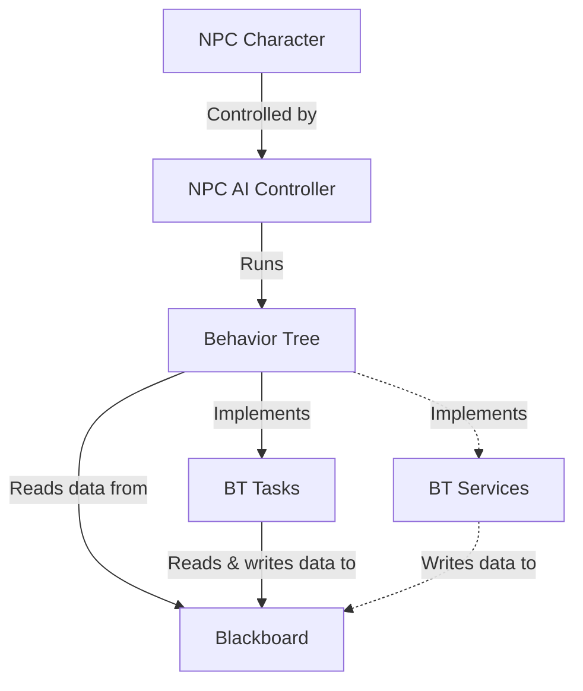

# GP25 AI Programming Assignment

## Overview
The goal of this project is to gain experience working with AI character tools and large-file source control in Unreal Engine. The heart of the project is a patrolling NPC implementation.

### Concept / Genre
The setting is ComicCon. The player character is awashed-up former celebrity who makes a living on the by signing autographs on the convention circuit for obsessed fans. The player character is on break, and must navigate the convention floor while avoiding detection by obsessed fans (who must register and wait in line to talk to them)

### Tools and Tech
*Environment*: Unreal Editor 5.7.4
*Project template*: Top-down third person
*Logic implementation*: Unreal blueprints
*Player movement*: Point-and-click / nav-mesh
*NPC control*: Behavior-tree / blackboard
*Source control*: Git with LFS support


## Content Folder Structure
```
Content/
|--Assignment/
|  |--NPC_00 (the RED guy)
|  |  |--BP_NPC_00_Character (character blueprint)
|  |  |--BP_NPC_00_Controller (AI controller blueprint)
|  |  |--BehaviorTree
|  |  |  |--BB_NPC_00_Blackboard
|  |  |  |--BT_NPC_00_BehaviorTree
|  |  |  |--(BT tasks & services blueprints)
|  |--NPC_01 (the GREEN guy)
|  |  |--BP_NPC_01_Character (character blueprint)
|  |  |--BP_NPC_01_Controller (AI controller blueprint)
|  |  |--BehaviorTree
|  |  |  |--BB_NPC_01_Blackboard
|  |  |  |--BT_NPC_01_BehaviorTree
|  |  |  |--(BT tasks & services blueprints)
|
(Template-provided folders & content)
|--Characters/
|  |--...
|--Cursor/
|  |--...
|--LevelPrototyping/
|  |--...
|--TopDown/
|  |--...

```

## NPC Implementation

### Outliner Hiererchy
```
Lvl_TopDown/ (Editor)
|--NPCS/
|  |--Team_00/ (RED guys)
|  |  |--NPC_00_00/
|  |  |  |--NPC_00_00_Character
|  |  |  |--PatrolPoints/ (serialized into character from the outliner)
|  |  |  |  |--TargetPoint_00
|  |  |  |  |--TargetPoint_01
|  |  |  |  |--(and so on)
|  |  |--NPC_00_01/
|  |  |  |-- (and so on)
|  |--Team_01/ (GREEN guys)
|  |  |--(and so on)
|
(Template-provided game objects)
|--Lighting/
|  |--...
|--Navigation/
|  |--...
|--Playground/
|  |--...
|--PlayerStart
|--RecastNavMesh-Default
|--WorldDataLayers
|--WorldPartitionMiniMap0
```

### NPC Component Architecture


*Note: The current implementation does not use a blackboard service. I originally had a service attached to the behavior tree's root selector that updates the `CanSeePlayer` blackboard value, but I moved this functionality into the NPC controller during refactoring.*

## NPC Character
The NPC character is implemented as blueprint BP_NPC_00_Character. This is the actor that owns the NPC controller (below), and is placed in level ouliner. This class inherits from the built-in `Character` blueprint, and uses the built-in "Quinn" character mesh.
### Blueprint Variables
The BP exposes the following configuration variables to the outliner:
- `PatrolPoints`: An array of `TargetPoint` objects that indicate the locations of the NPCs looping patrol behavior.
- `BaseWaitTime`: A float that respresents the amount of time the NPC will rest at each patrol point before moving on to the next.

The NPC character also maintains an internal integer index indicating which patrol point is the current one, `currentPatrolPointIndex`

 

### Blueprint Functions
The NPC character BP implements two functions:
- `GetCurrentPatrolPointLoc`: Returns the vector3 transform location of the NPC's current `TargetPoint`, as indicated internally by `currentPatrolPointIndex`


- `IncrementCurrentPatrolPoint`: Increments the value of `currentPatrolPointIndex`, modulated by the size of the `PatrolPoints` array.


Both of these functions are used by BT_NPC_BehaviorTree implementation, discussed below.

## NPC Controller
### EventGraph


The NPC controller event graph defines behavior for two events...
- *Event Begin Play*: When the game starts, the EG associates itself with the behavior tree `BT_NPC_00_BehaviorTree` (discussed below), and initiates its activity.
- *Event Target Perception Updated*: Most of the controller's logic is centered around this event. When the controller's `AIPerception` component (discussed below) signals that the player actor has entered or exited its perception field, it triggers the following logic:

    - *If the perception target is sensed* the EG updates the following blackboard keys in order:
        1) `LastKnownPlayerLocation`
        2) `CanSeePlayer`
        3) `IsChasingPlayer`

        The meaning of these keys is discussed below in the blackboard section.
    - *If the perception target is un-sensed* the EG sets the `CanSeePlayer` key to false. Importantly, the EG *does not* unset the `IsChasingPlayer` key here. This is because the NPC is expected to continue pursuing the player to its last known location and pause before returning to the patrol behavior.

### Blueprint Variables
The NPC controller has four internal variables of type `Name`, which hold the names of the blackboard keys that the controller must manipulate:
| `Name` variable name         | Value |
|------------------------------|-------|
| `CanSeePlayerKey`            | "CanSeePlayer" |
| `LastKnownPlayerLocationKey` | "LastKnownPlayerLocation" |
| `IsChasingPlayerKey`         | "IsChasingPlayer" |

### AI Perception
The NPC controller `AIPerception` component is configured with one sense (`AISense_Sight`)


## The NPC Blackboard

The NPC blackboard, `BB_NPC_00_Blackboard`, has six keys that inform the NPC behavior tree and in turn govern the NPC behavior:
- `SelfActor`: Built in self reference
- `MoveTarget`: Holds the transform location of the current patrol point
- `WaitSeconds`: The amount of time the NPC lingers at each patrol point before moving on
- `CanSeePlayer`: Whether or not the player actor is currently sensed by AI perception
- `LastKnownPlayerLocation`: Where the player is, or was the last time we saw them
- `IsChasingPlayer`: Is set when the NPC is in chase mode, whether the player is seen or not


## The NPC Behavior Tree

The NPC behavior tree, `BT_NPC_00_BehaviorTree`, implements two distinct behaviors:

- Patrolling behavior: The NPC is moving from between patrol points in sequence
- Chase behavior: The NPC is actively pursuing the player actor. This branch has two distict sub-branches:
  - While the player is sensed by AI perception (sight), then the chase target is continuously updated with the player's transform location plus the player's directional velocity. If the player is standing still, then the chase target is simply the player's transform location. If the player is moving, then the chase target is a position slightly in front of the player in the direction of movement.
  - If the player becomes unsensed, then the chase target is no longer updated and the chase target is the last known player position. When the NPC reaches that position, it waits a configurable number of seconds. If the player remains unsensed during that interval, then the `IsChasingPlayer` is flipped and the NPC reverts to its patrolling behavior.


### Patrolling Behavior:

In undecorated sequence:

1) Set the move target with task `BTT_NPC_00_SetMoveTarget`


2) In simple parallel, move to the current `MoveTarget` location and play the jog animation.

3) When the current `MoveTarget` is reached, call the NPC character's `IncrementPatrolPoint` function. This will cause the character to return the transform location of the next `TargetPoint` in its `PatrolPoints` array the next time `GetCurrentPatrolPointLoc` is called.


4) In simple parallel, wait for the amount of time indicated in the `WaitSeconds` blackboard key and play the idle animation.

### Chase Behavior

*If the player is sensed by AI perception, per the decorator for this branch*, then in sequence:

1) Set `LastKnownPlayerLocation` according to the the player's current transform location and velocity.


2) In simple parallel, move to the current `LastKnownPlayerLocation` and play the jog animation.

*If the player is not sensed by AI perception, but the NPC has not yet reached the `LastKnownPlayerLocation` per the decorator for this branch*, then in sequence:

1) In simple parallel, move to the `LastKnownPlayerLocation` (note that if the player is unsensed, then this value will not be updated every frame) and play the jog animation

2) In simple parallel, wait for a duration indicated by the `WaitSeconds` blackboard key and play the idle animation.

3) If `LastKnownPlayerLocation` is reached and the branch has not been preempted, then unset the `IsChasingPlayer` blackboard key. This will cause the BT to revert to the patrol branch.


## Reflections
...